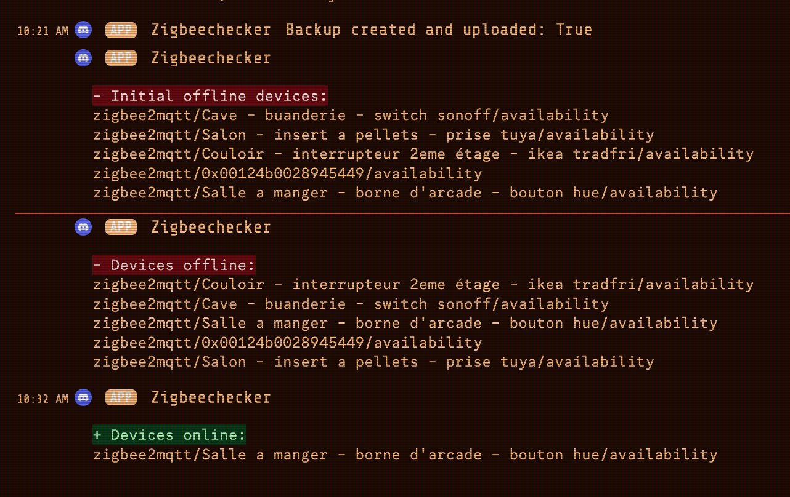

# Zigbee2MQTT Monitor and Backup Script

This script is designed to monitor the state of Zigbee2MQTT (Z2M) devices, automate backups, and handle device connectivity issues that may occur due to interferences. It can restart services and notify you through Discord when specific conditions are met.



## Features

- Monitors the state of Zigbee2MQTT devices.
- Automates daily backups of Zigbee2MQTT data.
- Notifies you via Discord about device statuses (online/offline).
- Automatically restarts Zigbee2MQTT and Mosquitto services if a specified number of devices go offline.

## Prerequisites

Before running this script, ensure you have the following:

- A Discord webhook URL for notifications.
- Docker installed and running.
- Containers named `zigbee2mqtt` and `mosquitto`. If your containers have different names, modify the script accordingly.
- An MQTT broker (e.g., Mosquitto) set up and running.

## Configuration

The script uses a configuration dictionary to manage its settings. You can adjust the following parameters:

- **mqtt_broker**: The IP address of the MQTT broker.
- **mqtt_port**: The port number of the MQTT broker.
- **mqtt_user**: The username for MQTT authentication.
- **mqtt_password**: The password for MQTT authentication.
- **zigbee2mqtt_topic**: The MQTT topic to subscribe to for Zigbee2MQTT updates.
- **backup_dir**: The directory where Zigbee2MQTT data is stored.
- **cloud_dir**: The remote directory for storing backups.
- **discord_webhook_url**: The Discord webhook URL for notifications.
- **notification_interval**: Time between notifications in seconds.
- **uptime_threshold**: Uptime threshold for Zigbee2MQTT restart in seconds.
- **offline_device_threshold**: Number of offline devices to trigger a restart.
- **check_interval**: Interval for checking container status in seconds.
- **backup_time**: Time for daily backup in "HH:MM" format.

## Installation

Follow these steps to set up the script:

1. **Clone the repository**:

    ```bash
    git clone https://github.com/silkyclouds/zigbee2mqtt_monitor.git
    cd zigbee2mqtt_monitor
    ```

2. **Create a virtual environment**:

    ```bash
    python3 -m venv venv
    ```

3. **Activate the virtual environment**:

    ```bash
    source venv/bin/activate
    ```

4. **Install the required dependencies**:

    ```bash
    pip install schedule requests docker paho-mqtt
    ```

## Running the Script

You can run the script manually or set it up as a systemd service for automatic startup:

### Manual Run

```bash
python zigbee2mqtt_monitor.py
